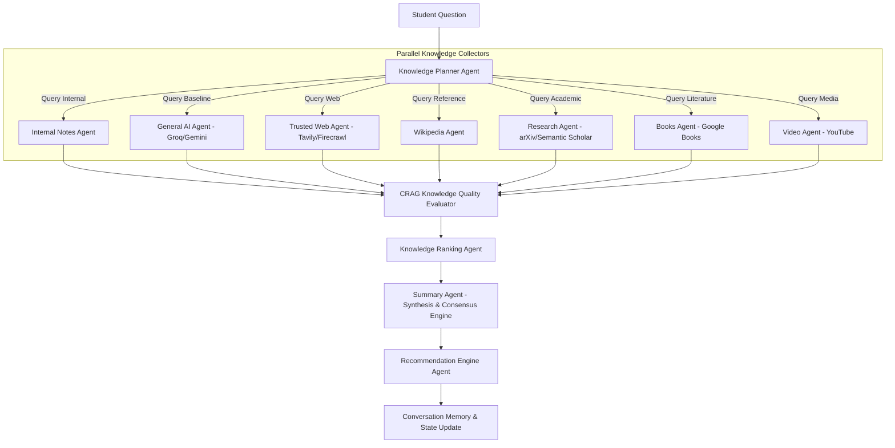

# EKIP Phase 2 Architectural Blueprint & Vision

> **Platform**: EKIP — Educational Knowledge & Intelligence Platform  
> **Motto**: *One Question → Multiple Trusted Knowledge Sources → AI Verification → Final Learning Summary*

---

## 1. Executive Summary & Product Vision

EKIP is evolving from an **Enterprise Knowledge Intelligence Platform** into the **Educational Knowledge & Intelligence Platform**. Rather than acting as a standard RAG chatbot, EKIP operates as an autonomous, multi-agent educational research engine.

### Paradigm Shift
- **Standard RAG / Chatbot**: `Question → Retriever → LLM → Answer`
- **EKIP Phase 2 Workflow**: `Question → Planner → Parallel Knowledge Collection → CRAG Verification → Evidence Ranking → Cross-Source Synthesis → Adaptive Guided Learning`

---

## 2. Multi-Agent LangGraph Architecture

LangGraph serves as the primary stateful orchestration engine, coordinating state transitions, parallel fan-out requests, conditional fallbacks, and multi-source evidence verification.



### Knowledge Planner Agent Logic
The Planner evaluates question semantics and dynamically triggers relevant API integrations to minimize latency and API consumption:
- *Conceptual Query* ("Explain Binary Search"): Selects `Groq`, `Uploaded Notes`, `Wikipedia`, `YouTube`. Skips academic papers.
- *State-of-the-Art Technical Query* ("Latest Transformer architectures"): Selects `Groq`, `arXiv`, `Semantic Scholar`, `Tavily`, `Firecrawl`. Skips YouTube.

---

## 3. CRAG as Knowledge Quality Evaluator

In Phase 2, **Corrective RAG (CRAG)** expands from evaluating local document chunks to auditing the factuality, relevance, and authority of all combined sources (Internal, Web, Wikipedia, Academic, Literature).

```
Source Data Stream ──► CRAG Quality Evaluator ──► Score [0.0 - 1.0] ──► Filter / Re-query / Rank
```

---

## 4. Multi-Layer UI & Answer Page Design

Responses are rendered in structured visual layers to ensure complete transparency, source attribution, and deep comprehension:

| Section | Title | Content & Components | Metadata Badges |
| :--- | :--- | :--- | :--- |
| **Section 1** | 🧠 **AI Explanation** | Direct baseline explanation generated by Groq. | `Provider: Groq` \| `Confidence Score: 90%+` |
| **Section 2** | 📄 **Uploaded Notes** | Extracted relevant chunks from user's uploaded repository, or explicit `"No relevant uploaded documents"` status. | `Matches: N docs` \| `Similarity Score` |
| **Section 3** | 🌍 **Trusted Web** | Summarized facts from Tavily & Firecrawl/Jina AI Reader. | `Provider: Tavily` \| `Confidence: 91%` |
| **Section 4** | 📖 **Wikipedia** | Quick overview, key definitions, and historical context. | `Provider: Wikipedia` |
| **Section 5** | 🎓 **Research Papers** | Semantic Scholar & arXiv cards displaying Title, Authors, Year, Abstract, and DOI link. | `Source: arXiv / Semantic Scholar` |
| **Section 6** | 📚 **Books** | Google Books cards displaying Book Title, Author, Preview link. | `Source: Google Books` |
| **Section 7** | 🎥 **Videos** | Educational video cards displaying YouTube Video Title, Channel, Duration, Preview thumbnail. | `Source: YouTube` |
| **Section 8** | ✅ **Final Learning Summary** | Unified synthesis highlighting source agreements, discrepancies, and key takeaways. | `Verified Consensus Synthesis` |

---

## 5. Guided Learning & Recommendation Engine

After every answer, the **Recommendation Engine Agent** analyzes the conversation context and produces 3 logical follow-up questions to turn Q&A into an ongoing learning journey:

```
Continue Learning
1. How does AI differ from Machine Learning?
2. What are the key practical applications of AI?
3. Explain Deep Learning with real-world examples.
```

### Educational Quick Actions
- 📘 **Explain a concept**
- 📝 **Summarize my notes**
- 📚 **Compare two topics**
- 🔬 **Find research papers**
- 🌐 **Search trusted sources**
- 🎥 **Recommend learning videos**
- 📖 **Create study notes**
- ❓ **Generate quiz questions**

---

## 6. Multi-Tiered API Strategy

| Tier | Category | Primary Provider | Fallback / Additional |
| :--- | :--- | :--- | :--- |
| **Tier 1** | General AI | **Groq** (Fast Llama-3) | Gemini, Cohere, Mistral |
| **Tier 2** | Web Search | **Tavily API** | DuckDuckGo Search |
| **Tier 3** | Content Extraction | **Firecrawl** | Jina AI Reader |
| **Tier 4** | Academic | **Semantic Scholar API** | arXiv API |
| **Tier 5** | Educational Reference | **Wikipedia API** | Google Books API, YouTube Data API |

---

## 7. Migration & Evolution Strategy

Existing components preserved and integrated as foundational building blocks:
- ✅ **Hybrid Retrieval** (Local BM25 + Vector Search)
- ✅ **Multi-LLM Failover Engine**
- ✅ **Conversation Memory & Telemetry**
- ✅ **Analytics Dashboard & Diagnostics**
