# EKIP — Information Architecture & Site Map Specification

> **System**: Educational Knowledge Intelligence Platform (EKIP)  
> **Phase**: Phase 2.95 — Product Design & UX Architecture  
> **Document Type**: Information Architecture & Complete Site Map  

---

## 1. Product Navigation Philosophy

EKIP is architected as an **AI Learning Operating System**. Unlike standard AI chatbots that present a transient thread of messages, EKIP organizes knowledge into persistent workspaces, structured lesson pages, learning journeys, practice modules, and analytical progress tracking.

---

## 2. Primary Navigation Hierarchy

The top-level navigation structure consists of 8 main application hubs:

```
[ EKIP AI Learning OS ]
 ├── 🏠 Dashboard (Personalized Command Center)
 ├── 🎓 Learn (Topic-Driven Structured Lessons)
 ├── 🔍 Research (Multi-Source Literature & Evidence Discovery)
 ├── 🧠 Practice (Adaptive Practice Hub: Flashcards, Quizzes, Coding, Interview Prep)
 ├── 📚 Workspace (Personal & Team Study Library, Notebooks, Bookmarks)
 ├── 📈 Progress (Learning Analytics & Proficiency Tracking)
 ├── ⚙ Settings (User Profile, Preferences & Subscription Management)
 └── 🛡️ Admin Console (Organization, Multi-User & System Diagnostics - Role Gated)
```

---

## 3. Section Deep-Dives

### 3.1 🏠 Dashboard (`/dashboard`)
- **Purpose**: Personalized daily learning command center.
- **User Goals**: Resume ongoing learning sessions, check daily goals, launch quick research, view upcoming tasks.
- **Key Modules**: Welcome Header, Continue Learning Carousel, Today's Goal Tracker, Knowledge Journey Snapshot, Quick Search Bar, Learning Analytics Cards.

### 3.2 🎓 Learn (`/learn`)
- **Purpose**: Lesson-oriented knowledge acquisition replacing standard chat interfaces.
- **User Goals**: Master specific academic concepts with structured evidence and multimodal resources.
- **Key Modules**: Topic Header, Overview, AI Explanation, Uploaded Notes, Research Papers, Textbooks, Videos, Conflicting Views, Glossary, Key Takeaways, Next Steps.

### 3.3 🔍 Research (`/research`)
- **Purpose**: Academic literature discovery and multi-source evidence extraction.
- **User Goals**: Cross-examine papers, compare study results, identify research gaps, and export citations.
- **Key Modules**: Multi-Agent Search Query Engine, Evidence Verification Matrix, Citation Exporter, Research Gap Identifier, Source Filter.

### 3.4 🧠 Practice (`/practice`)
- **Purpose**: Active recall and adaptive self-testing hub.
- **User Goals**: Test retention, solve coding exercises, practice technical interviews, and review flashcards.
- **Key Modules**: Adaptive Flashcards, Quiz Engine, Mind Map Visualizer, Revision Assistant, Interview Prep, Coding Practice Environment.

### 3.5 📚 Workspace (`/workspace`)
- **Purpose**: Long-term persistent learning library and team collaboration.
- **User Goals**: Organize notes, manage collections, share study notebooks with peers, bookmark resources.
- **Key Modules**: Personal Library, Shared Notebooks, Course Collections, Document Repository, Tagging Engine.

### 3.6 📈 Progress (`/progress`)
- **Purpose**: Mastery tracking and skill visualizer.
- **User Goals**: Inspect study stats, track subject proficiency, analyze quiz performance, measure time spent.
- **Key Modules**: Interactive Skill Tree, Retention Curves, Quiz Accuracy Trends, Module Telemetry, Study Streaks.

### 3.7 ⚙ Settings (`/settings`)
- **Purpose**: Account management, preferences, and subscription tier.
- **User Goals**: Update personal info, change theme, manage API keys, inspect storage quotas.
- **Key Modules**: Profile Details, Theme Toggles (Dark/Light), Subscription Plan, Security & Sessions.

### 3.8 🛡️ Admin Console (`/admin`)
- **Purpose**: Multi-tenant organization and user administration.
- **User Goals**: Manage course enrollments, audit user activity, monitor provider health, check billing usage.
- **Key Modules**: User Management Table, Course Manager, Organization Quotas, Provider Diagnostics, Audit Logs.

---

## 4. Complete System Site Map

```mermaid
graph TD
    App[EKIP Platform] --> Auth[Authentication / Register / Login]
    App --> Main[Main Shell Nav]

    Main --> Dash[Dashboard]
    Dash --> QuickAsk[Quick Search Modal]
    Dash --> Recents[Recent Sessions]
    Dash --> ProgressSnap[Analytics Snapshot]

    Main --> Learn[Learn Hub]
    Learn --> LessonPage[Structured Lesson Page]
    LessonPage --> AIExp[AI Explanation]
    LessonPage --> ResearchSec[Research Papers]
    LessonPage --> VideoSec[Educational Videos]
    LessonPage --> GlossarySec[Interactive Glossary]

    Main --> Practice[Practice Hub]
    Practice --> Flashcards[Adaptive Flashcards]
    Practice --> Quizzes[Quiz Engine]
    Practice --> Coding[Coding Practice]
    Practice --> Interview[Interview Prep]

    Main --> Workspace[Workspace Hub]
    Workspace --> Notes[Personal Notebooks]
    Workspace --> Shared[Team Shared Workspaces]
    Workspace --> Docs[Document Ingestion]

    Main --> Progress[Progress Hub]
    Progress --> SkillTree[Knowledge Journey Graph]
    Progress --> Stats[Proficiency Metrics]

    Main --> Settings[Settings Hub]
    Settings --> Profile[User Profile]
    Settings --> Billing[Subscription & Billing]

    Main --> Admin[Admin Console - Role Gated]
    Admin --> UserMgmt[User Management]
    Admin --> CourseMgmt[Course & Enrollment]
    Admin --> ProviderDiag[Provider Diagnostics]
```


