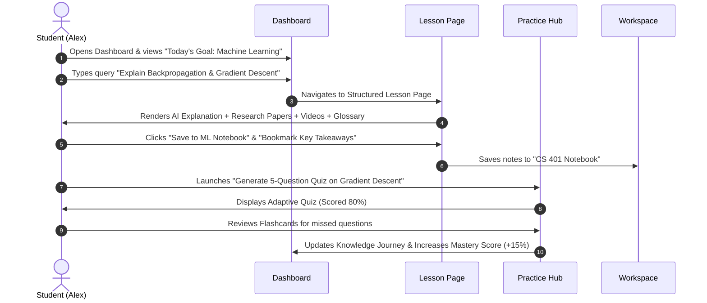
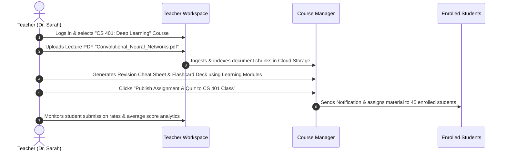
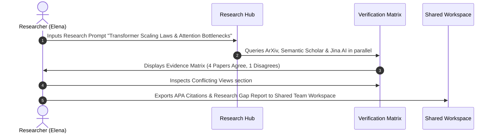
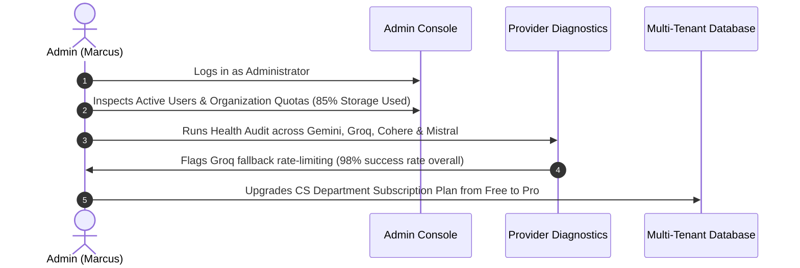

# EKIP — Persona User Journey Mapping Specification

> **System**: Educational Knowledge Intelligence Platform (EKIP)  
> **Phase**: Phase 2.95 — Product Design & UX Architecture  
> **Document Type**: End-to-End Persona Journey Mapping  

---

## 1. Primary User Personas

| Persona | Role | Primary Objectives | Key Pain Points |
|---|---|---|---|
| **Alex (Student)** | Undergraduate Computer Science | Prepare for exams, understand complex topics with evidence, practice coding and quizzes. | Scattered study notes, hallucinated AI answers, lack of structured revision paths. |
| **Dr. Sarah (Teacher)** | Associate Professor | Create courses, publish study materials, assign quizzes, monitor student comprehension. | Manual grading overhead, difficulty tracking real-time student engagement. |
| **Elena (Researcher)** | PhD Candidate | Extract research paper findings, compare conflicting evidence, spot research gaps. | Reading 100+ PDFs manually, untangling contradictory study results. |
| **Marcus (Admin)** | IT & Academic Administrator | Manage organization users, monitor platform usage, control API provider health and billing. | Security vulnerabilities, unmonitored API usage, lack of role permissions. |

---

## 2. End-to-End Persona Journeys

### 2.1 Student Journey: Exam Preparation Workflow

---

### 2.2 Teacher Journey: Course Material & Quiz Publishing Workflow

---

### 2.3 Researcher Journey: Evidence Extraction & Literature Synthesis

---

### 2.4 Administrator Journey: Platform Audit & Organization Health

