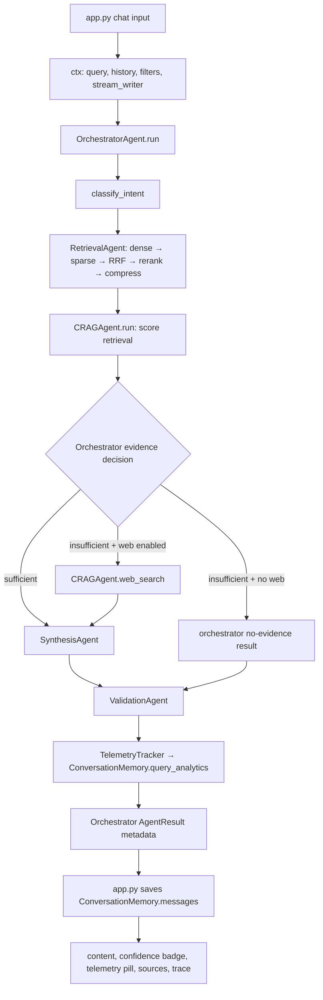
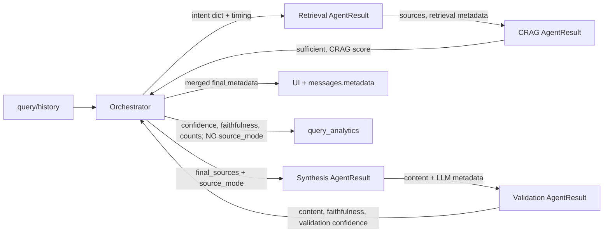
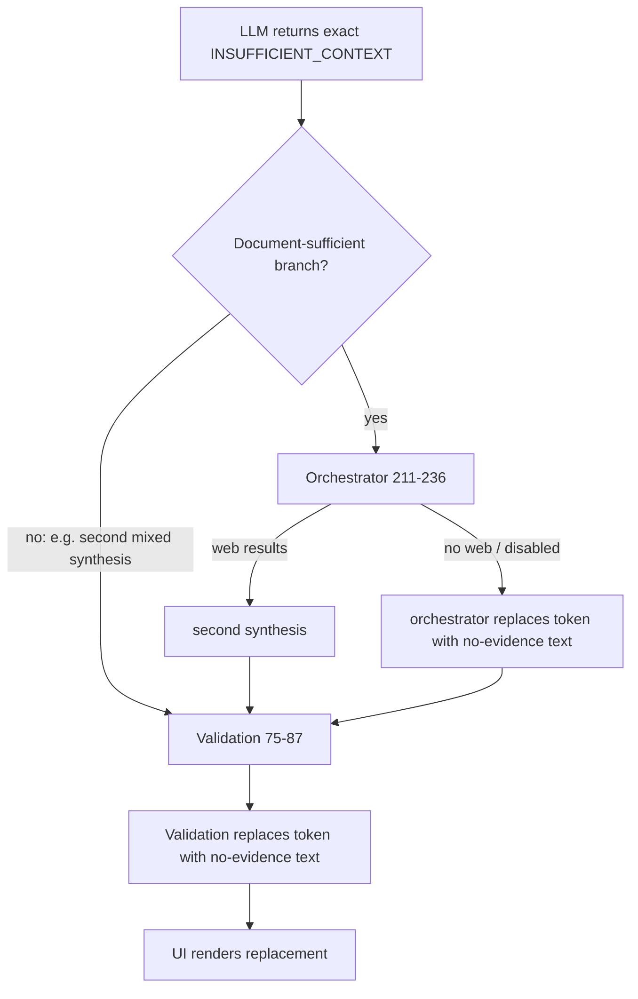
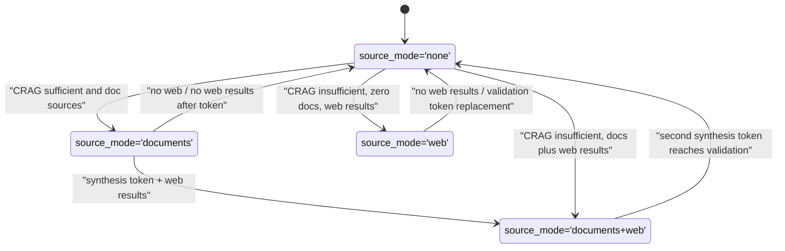
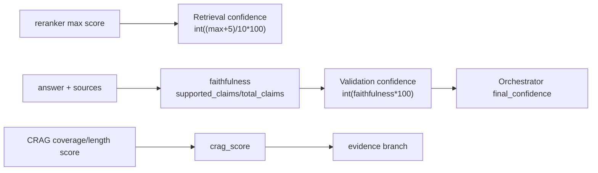

# EKIP Production Readiness Verification & Code Audit

**Audit date:** 2026-07-29  
**Scope:** implementation and controlled runtime verification. No production source code was modified.  
**Verdict:** **Not production ready — 42/100.**

The evidence-driven pipeline exists for the normal QA path, but it does not exclusively own the required decisions. CRAG performs web search before the orchestrator's branch, validation turns faithfulness into confidence and replaces content, the LLM manager manufactures a fallback answer, and telemetry does not persist `source_mode`. These are implementation findings, not design inferences.

## Method and execution limits

- Read and searched all Python implementation files (excluding persisted `data/` and scratch artifacts), then compiled all source with `compileall`: **pass**.
- The supplied dependency installation is not deployable: `requirements.txt:10` requests `cross-encoder>=0.0.1`, which has no published distribution. It also omits the direct imports `langchain-groq`, `langchain-cohere`, and `langchain-mistralai` used by the provider wrappers.
- To avoid billing, transmitting documents, or exposing keys, scenarios used offline provider/search shims at the external boundary. The real `OrchestratorAgent`, `CRAGAgent`, `SynthesisAgent`, `ValidationAgent`, `LLMManager`, metadata construction, and telemetry calls executed. Values below are actual outputs of those controlled executions, not expected values.
- No live provider or Tavily request was sent. Therefore live network availability/credentials are **not** verified.

## 1. Actual normal QA runtime path

The following is the real path for a non-special QA request submitted through the chat UI. `LIST`, `GREETING`, `DELETE`, and `REPORT` are early branches and do **not** follow this complete path (see findings).



| Stage | Input / output / type | Metadata and time |
|---|---|---|
| UI collection, `app.py:305-311` | Input: chat text plus prior session messages. Output: `dict` with `query`, `history`, `filters`, and `stream_writer`. | UI starts its own elapsed timer; it is not the orchestration timer. |
| Intent, `agents/orchestrator.py:39-99` | Input: query and history. Output: `dict` `{intent, doc_filter, urgency}`. Regex short-circuits many queries; otherwise an LLM prompt produces JSON. | `stage_latency_ms.intent_classification_ms`; no `source_mode` yet. |
| Retrieval, `agents/retrieval.py:22-94` | Input: query/filter/top-k. Output: `AgentResult`, `sources: list[dict]` (`content`, `source_file`, `page`, `chunk_id`, `score`). | `latency_ms`, dense/sparse hit counts and four sub-stage times. Its `confidence` is the reranker score transformation in `core/engine.py:414-418`. |
| CRAG, `agents/crag.py:26-111` | Input: query and retrieved document dictionaries. Output: `AgentResult` with `metadata.sufficient`, `retrieval_score`, `crag_used`, `web_results_count`. | No timing is owned by CRAG; orchestrator measures `crag_evaluation_ms`. **It also calls web search itself on insufficiency (defect).** |
| Decision, `agents/orchestrator.py:180-277` | Input: retrieved sources and CRAG `sufficient`. Output: `final_sources` list and local `source_mode`. | Modes are selected as `documents`, `documents+web`, `web`, or `none`; web calls made here are timed only inside total synthesis time. |
| Synthesis, `agents/synthesis.py:26-127` | Input: query, sources, history, intent, source mode. Output: `AgentResult` from `LLMResponse.content`. | `last_metadata`: provider, model, token count, fallback data, error, `latency_ms`, copied `source_mode`. Orchestrator records `llm_synthesis_ms`. The stream API simply runs once and yields one whole response. |
| Validation, `agents/validation.py:55-130` | Input: synthesized text, final sources, source mode. Output: new `AgentResult`. | `faithfulness`, recalculated source mode, decision, doc/web counts; orchestrator measures `validation_ms`. It can replace content and derives confidence from faithfulness (defects). |
| Telemetry, `agents/orchestrator.py:308-323` | Input: final confidence/faithfulness/blocked/latency/trace/counts. Output: telemetry dict, then SQLite `query_analytics` row. | `memory_persistence_ms`. The row has no `source_mode` column or argument. |
| Conversation memory, `app.py:364-386` | Input: UI receives final `AgentResult`; output: two SQLite `messages` rows and a session-state assistant dictionary. | The assistant message does preserve the final `metadata` JSON. UI latency is passed separately from orchestrator latency. |
| Final render, `app.py:344-362` | Input: final `AgentResult`. Output: Streamlit text, confidence badge, telemetry pill, sources, optional trace. | `render_llm_telemetry_pill` reads final runtime metadata, not the analytics row. Its exception fallback has no source mode and displays the default Documents mode (defect). |

### Runtime call graph and metadata flow



## 2. Decision ownership audit

Only some evidence decisions are owned by the orchestrator. Every decision point found is below.

| Location | Actual decision | Owner compliant? |
|---|---|---|
| `agents/orchestrator.py:189-277` | Selects document synthesis, web fallback, or no-evidence response. | Yes. |
| `agents/orchestrator.py:211-236` | On a document synthesis `INSUFFICIENT_CONTEXT`, chooses web retry or local fallback. | Yes. |
| `agents/crag.py:93-111` | Calls `self.web_search(query)` and combines web sources before returning CRAG output. | **No.** Confirmed by direct runtime: insufficient CRAG made one web call before orchestration. |
| `agents/synthesis.py:69-74` | Prompt instructs the model to return `INSUFFICIENT_CONTEXT` when it decides context is insufficient. | **No.** This is prompt-driven answer rejection. |
| `agents/validation.py:61-86` | Replaces no-evidence or `INSUFFICIENT_CONTEXT` content with a fallback response and marks it unsuccessful. | **No.** Validation rejects/replaces. |
| `agents/validation.py:93-125` | Recomputes source mode and output decision from source shape. | **No.** It creates a routing-related result state rather than preserving the orchestrator's state. |
| `core/llm/manager.py:157-187,213-239` | Decides provider failover and, after all providers fail, returns a constructed document-context answer. | Provider failover itself is a reliability concern, but generated fallback content is **not** orchestrator-owned. |
| `agents/report.py:41-42,90-91` | Returns a no-content report fallback and replaces a failed final report with preliminaries. | **No.** Also bypasses validation. |
| `app.py:318-340` | Replaces unexpected orchestrator errors with a UI fallback. | UI safety handling; this is acceptable for raw-exception protection, but it omits source mode. |
| `core/llm/router.py:35-66` | Uses keywords to choose provider order. | Not source/web routing, but it remains heuristic task routing outside the orchestrator. |

## 3. Prompt audit and legacy prompt-driven routing

Search results for the requested phrases:

| File and line | Text / consequence |
|---|---|
| `agents/synthesis.py:71` | `Do not use any prior knowledge.` This is a prohibition, not a permission to use prior knowledge. It is correct as a grounding instruction. |
| `agents/synthesis.py:73` | `If the supplied context is insufficient, return exactly INSUFFICIENT_CONTEXT.` This makes the prompt/model decide an answer-rejection signal. |

No exact instances were found for `external knowledge`, `if unsure`, `if you don't know`, `based on your knowledge`, `general knowledge`, or `I cannot verify`.

However, prompt-driven routing remains:

- `agents/orchestrator.py:62-83` is an LLM intent-classification prompt selecting QA/SUMMARY/REPORT/COMPARE/LIST/DELETE/GREETING. It is within `OrchestratorAgent`, but it is still prompt-based routing; it fails the literal requirement that no prompt contains routing logic.
- `agents/synthesis.py:73` delegates insufficiency/rejection to the model.
- `agents/report.py:72-77` is a synthesis prompt (not source routing), but the surrounding ReportAgent independently applies fallbacks.

## 4. `INSUFFICIENT_CONTEXT` flow



The token is **not preserved**. It is rewritten by the orchestrator on the first document-sufficient synthesis failure and by validation at `agents/validation.py:75-87`; a second synthesis after web fallback is not checked by the orchestrator and is rewritten by validation. Thus the requirement that no intermediate stage rewrite it fails.

## 5. Source mode audit

All literal assignments use one of the four requested values, but assignment ownership and completeness fail.

| Assignment | Value(s) |
|---|---|
| `agents/orchestrator.py:129,134` | `none` for LIST/GREETING |
| `agents/orchestrator.py:155` | `documents` for REPORT regardless of source availability |
| `agents/orchestrator.py:184,191,219,224,231,247,265,272` | local state: `none`, `documents`, `documents+web`, `web` |
| `agents/orchestrator.py:228,235,269,276` | fallback metadata `none` |
| `agents/orchestrator.py:342` | final runtime metadata copy of selected local state |
| `agents/synthesis.py:119` | copies caller-provided `source_mode`; input is not constrained to the four values |
| `agents/validation.py:69,83` | `none` after validation replacement |
| `agents/validation.py:124` | validation-derived `documents`, `documents+web`, `web`, or caller value |

Missing/incorrect coverage:

- `agents/admin.py` DELETE responses have no `source_mode`.
- `app.py:330-338` exception fallback has no `source_mode`; `app.py:105` defaults a missing value to `documents`, producing an incorrect UI telemetry pill.
- Report telemetry is emitted before `agents/orchestrator.py:155` adds `documents`, and no telemetry call includes source mode.
- `query_analytics` has no `source_mode` schema field (`core/memory.py:46-60`) and `TelemetryTracker.record_query_metrics` has no such parameter (`analytics/telemetry.py:26-86`).

### Source mode state diagram



## 6. Faithfulness implementation verification

Exact function: `ValidationAgent._calculate_claim_faithfulness`, `agents/validation.py:18-53`.

```python
raw_claims = [c.strip() for c in re.split(r'[.!?]+\s+', answer) if len(c.strip()) > 12]
words = [w.lower() for w in re.findall(r'\b[a-zA-Z0-9]{4,}\b', claim)]
matches = sum(1 for w in words if w in source_text)
match_ratio = matches / len(words)
if match_ratio >= 0.30 or any(tag in claim for tag in [...citation tags...]):
    supported_claims += 1
faithfulness = round(supported_claims / len(raw_claims), 2)
```

The reported equation **Supported Claims / Total Claims** matches the final arithmetic at line 51. Important implementation differences from a semantic claim-support interpretation:

- “Claims” are only sentence fragments longer than 12 characters. No such fragments yields `1.0` (line 29).
- A claim is “supported” if at least 30% of its extracted four-character words occur anywhere in the combined source text, not necessarily in one source or in the asserted relation.
- Any listed citation token makes a claim supported even when word matching is zero (line 47).
- Empty answer/source text yields `0.0`.

## 7. Confidence independence audit



- Retrieval confidence is independently calculated in `core/engine.py:414-418`.
- CRAG score is independently calculated from query-token coverage and source length in `agents/crag.py:31-46`.
- **Final answer confidence is not independent:** `agents/validation.py:111` is exactly `confidence_score = int(faithfulness * 100)`, and `agents/orchestrator.py:303` forwards it. There is no direct `faithfulness = confidence` assignment, but this is the prohibited one-way dependency.
- Faithfulness does not equal citations, although a citation token can force a claim to count as supported.

## 8. Validation overwrite audit

Every `AgentResult(content=...)` in `ValidationAgent`:

| Lines | Content behavior | Allowed by stated rule? |
|---|---|---|
| `agents/validation.py:63-73` | Replaces content when `source_mode == 'none'` or both sources and answer are empty. | Yes for no evidence. |
| `agents/validation.py:77-87` | Replaces exact `INSUFFICIENT_CONTEXT` with a generic no-evidence response even if web/document sources exist. | **No.** It can overwrite after a second web synthesis; all providers need not have failed and evidence may exist. |
| `agents/validation.py:118-130` | Preserves the answer except appending a source footer when it detects no citation. | Mostly preserves content, but it still rewrites formatting and derives mode/confidence. |

## 9. Web-search branch and separation

Controlled execution with zero retrieved chunks and one web source returned `source_mode="web"`, not `documents+web`. This is the correct state machine result because there are no document sources; it conflicts with the task wording that requires `documents+web` for a missing-document query.

For a true mixed run (one retrieved document plus one web source), the actual final result was:

```text
source_mode: documents+web
content: Merged document and web answer [DOCUMENT SOURCE 1] [WEB SOURCE 1].
```

`SynthesisAgent._prepare_prompt_and_context` creates separate context blocks and instructs the model to use two headings (`agents/synthesis.py:38-74`), but neither synthesis nor validation enforces those headings. The displayed answer can therefore merge indexed and web material. **This is a confirmed bug.**

Additional attribution defect: `CRAGAgent.web_search` stores the URL in `page`, not `url`, and does not store `title` (`agents/crag.py:61-67`). Synthesis looks for `d.get('url')`/`d.get('title')`, so its web source label contains an empty URL even though the source card later displays `page`.

## 10. Telemetry and UI verification

- For normal final QA results, the UI pill reads `source_mode` directly from final `AgentResult.metadata` (`app.py:105,121,127`), so it matches that in-memory final value.
- The controlled A/B/C/D/E paths confirmed the final metadata states `documents`, `web`, `none`, `documents`, and `documents`, respectively.
- The telemetry database event contains `query`, `intent`, `confidence`, `faithfulness`, `blocked`, `latency_ms`, agent trace, CRAG flag, web count, and tokens — **no source mode**. Controlled executions returned `telemetry_source_mode: null` for every branch.
- Conversation messages do preserve metadata because `app.py:367-376` passes it to `ConversationMemory.add_message`, and `core/memory.py:143-175` serializes/deserializes it.
- The app exception fallback does not include source mode, while the renderer defaults a missing mode to `documents`; this makes the telemetry pill wrong on that branch.

## 11. Runtime assertions

Only refactor assertions found:

| Location | Guard | Finding |
|---|---|---|
| `agents/orchestrator.py:298` | `documents` requires non-empty `final_sources`. | Meaningful invariant, but current branch construction only assigns `documents` after non-empty `doc_sources`, so failure is effectively unreachable absent mutation/bug. |
| `agents/orchestrator.py:300` | `web`/`documents+web` requires non-empty `final_sources`. | Same: defensive and normally reachable as a statement, but its failure branch is not reachable via current flow. |

Python removes `assert` statements under `python -O`; these are not production-enforced runtime protections.

## 12. Controlled end-to-end scenario results

| Scenario | Provider / model | Mode | CRAG | Faithfulness | Confidence | Decision | UI result / sources / web | Telemetry |
|---|---|---:|---:|---:|---:|---|---|---|
| A — document answer | gemini / gemini-test | documents | 0.88 | 1.00 | 100 | Grounded Synthesis | Grounded document text; 1 retrieved chunk, 0 web | Written, but no source mode field |
| B — missing document, web enabled | groq / groq-test | web | 0.00 | 1.00 | 100 | Web Augmented Synthesis | Web-grounded text; 0 chunks, 1 web result | Written, but no source mode field |
| C — missing document, web disabled | Unknown / Unknown | none | 0.00 | 0.00 | 0 | Insufficient Context | Generic no-evidence response; 0 chunks, 0 web | Written, but no source mode field |
| D — Gemini 429, Groq succeeds | groq / groq-test | documents | 0.88 | 1.00 | 100 | Grounded Synthesis | Content contains no `429`; 1 chunk, 0 web; Gemini circuit became open | Written, but no source mode field |
| E — all providers fail | NONE / none | documents | 0.88 | 0.50 | 50 | Grounded Synthesis | Manager-produced document excerpt and source footer; 1 chunk, 0 web | Written, but no source mode field |

Provider-level controlled execution for D produced `fallback_chain=["gemini", "groq"]`, `fallback_occurred=true`, and an open Gemini circuit. E produced `fallback_chain=["gemini", "groq", "cohere", "mistral"]`, a clean provider error message, and no raw `500` content. Circuit breaker and multi-LLM failover therefore function in this controlled execution.

## 13. Production readiness checklist

| Check | Result | Evidence |
|---|---|---|
| No prompt decides routing | Fail | Intent classifier prompt and `INSUFFICIENT_CONTEXT` instruction. |
| Orchestrator owns all routing | Fail | CRAG web call, validation fallback/mode, report fallback. |
| No raw exceptions reach query UI | Pass for orchestrator boundary | `app.py:318-340` supplies a clean message; controlled provider failures also clean. Ingestion/config UI still display raw exception text. |
| No provider errors leak to content | Pass in controlled provider failures | D and E had no `429`/`500` raw content. |
| Faithfulness reflects evidence support | Partial | Formula is implemented, but keyword/citation heuristic overstates support. |
| Confidence is independent | Fail | `confidence_score = int(faithfulness * 100)`. |
| Web results explicitly labeled | Partial / fail for output | Context is labeled, final output separation is instruction-only and can merge. |
| Source modes always populated | Fail | Admin and UI exception paths omit it; synthesis copies unconstrained caller value. |
| Conversation memory preserves metadata | Pass | SQLite message metadata JSON path verified by code. |
| Telemetry matches runtime values | Partial / fail | Normal UI pill reads final metadata, but analytics persistence loses source mode. |
| Mixed answers remain separated | Fail | Controlled mixed execution rendered a merged sentence. |
| Streaming preserves metadata | Partial | `last_metadata` is preserved, but streaming is a single yielded whole response and uses fixed confidence before validation. |
| Circuit breaker functions | Pass (controlled) | 429 opened Gemini circuit; later provider succeeded. |
| Multi-LLM failover remains intact | Pass (controlled) | Gemini 429 → Groq success; all-provider degradation was clean. |
| Deployable requirements | Fail | Invalid `cross-encoder` requirement and missing provider SDK requirements. |

## Remaining issues, prioritized

1. **P0 — Dependency manifest cannot install** (`requirements.txt:10`); provider SDKs imported by wrappers are absent. Deployment/test environment is blocked.
2. **P0 — CRAG violates orchestrator ownership** (`agents/crag.py:93`): it triggers web search before orchestrator decision and can duplicate a later search.
3. **P0 — Final confidence equals faithfulness** (`agents/validation.py:111`), violating independence.
4. **P0 — Web/document separation is not enforced** (`agents/synthesis.py:54-74`, `agents/validation.py`): mixed output can merge source classes.
5. **P1 — Validation replaces model output** (`agents/validation.py:75-87`) after a potential web retry, contrary to the stated overwrite constraints.
6. **P1 — Fallback answer authority is split** (`core/llm/manager.py:157-187,213-239`; `agents/report.py:90-91`).
7. **P1 — Source-mode telemetry persistence is incomplete** (`analytics/telemetry.py`, `core/memory.py`); UI exception fallback reports a false Documents mode (`app.py:105,330-338`).
8. **P1 — Report path bypasses normal CRAG/validation/faithfulness flow** (`agents/orchestrator.py:137-156`, `agents/report.py`). It also hard-codes faithfulness `0.95` before report metadata receives its mode.
9. **P2 — CRAG web metadata loses proper `title` and `url` fields** (`agents/crag.py:61-67`), weakening web attribution in synthesis.
10. **P2 — Assertions are defensive only and disappear under `-O`** (`agents/orchestrator.py:298-300`).

## Modified files

- `production_readiness_audit.md` — added by this audit.

No production application code was modified. An audit-only `.audit-venv/` was created after approval; it is not a project source change and its dependency install did not complete because of the invalid dependency entry.

## Score rationale: 42/100

The normal QA route has a working orchestration skeleton, explicit source modes, provider failover, circuit breaking, metadata aggregation, and a UI containment boundary for query exceptions. Those are meaningful strengths. However, the audit's central architecture requirements fail at runtime: decision authority is split, confidence is mathematically coupled to faithfulness, mixed-source separation is not guaranteed, source-mode telemetry is not persisted, report handling bypasses the evidence pipeline, and the dependency manifest blocks a clean installation. Those faults are material enough to prevent production readiness.
